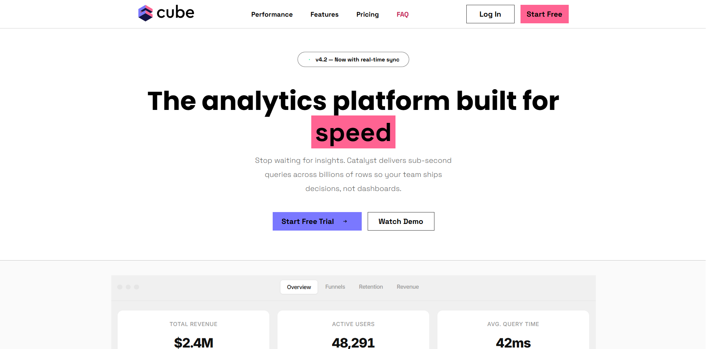
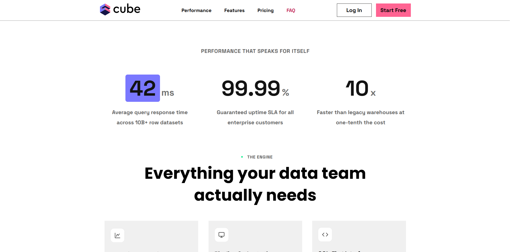
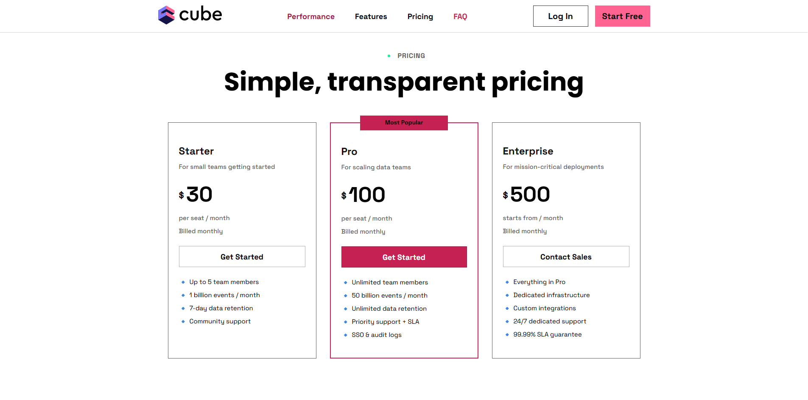
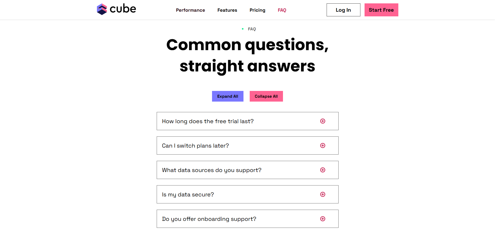
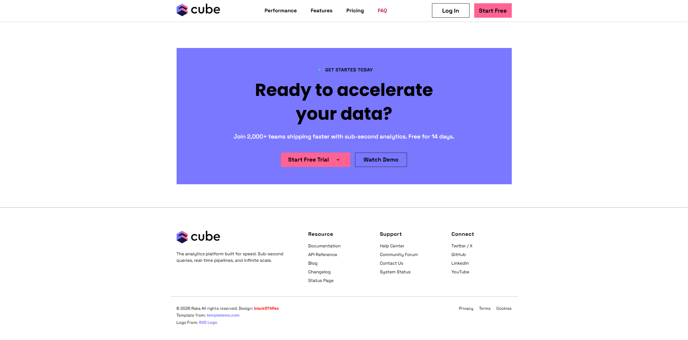

# 🚀 Cube - Analytics Platform Landing Page

A modern, responsive landing page built with **HTML5** & **CSS3**. This project showcases a clean SaaS-style UI for an analytics platform called **Cube**, featuring responsive layouts, pricing cards, performance metrics, FAQ, and a polished footer.

---

## 📸 Preview











---

## ✨ Features

- 🎨 Modern SaaS landing page design
- 📱 Fully responsive for desktop, tablet, and mobile
- ⚡ Built using Vanilla HTML & CSS
- 🧩 Clean and organized HTML & CSS
- 📊 Performance statistics section
- 💳 Pricing cards
- ❓ FAQ section
- 📢 Call-to-action banner
- 🦶 Responsive footer

---

## 🛠️ Tech Stack

| Technology | Purpose |
|------------|---------|
| 🌐 HTML5 | Page Structure |
| 🎨 CSS3 | Styling & Responsive Design |
| 🔤 Google Fonts | Typography |

---

## 📂 Project Structure

```text
Cube/
│
├── Assets/
│   ├── cube.svg
│   ├── Table.png
│   ├── eng1.png
│   ├── eng2.png
│   ├── eng3.png
│   └── ...
│
├── index.html
├── style.css
└── README.md
```

---

## 🚀 Getting Started

### 1. Clone the repository

```bash
git clone https://github.com/blackST4Rez/Cube.git
```

### 2. Navigate into the project

```bash
cd Cube
```
---

## 🌍 Deployment

This project was deployed on:

- 🌐 Netlify

---

## 📱 Responsive Design

The landing page is optimized for:

- 💻 Desktop
- 💼 Laptop
- 📱 Tablet
- 📲 Mobile

---

## 🎯 Future Improvements

- 🌙 Dark Mode
- 🍔 Interactive Mobile Navigation
- ❓ Expandable FAQ
- ✨ Smooth Animations
- 📧 Functional Contact Form

---

## 🙌 Credits

- 🎨 Design inspired by **TemplateMo**
- 🖼️ Logos from **SVG Logos**
- 🔤 Fonts by **Google Fonts**

---

## 👨‍💻 Author

**Raka Maharjan**

GitHub: https://github.com/blackST4Rez

---

## 📄 License

This project is open-source and available under the **MIT License**.

---

⭐ If you like this project, consider giving it a **Star** on GitHub!